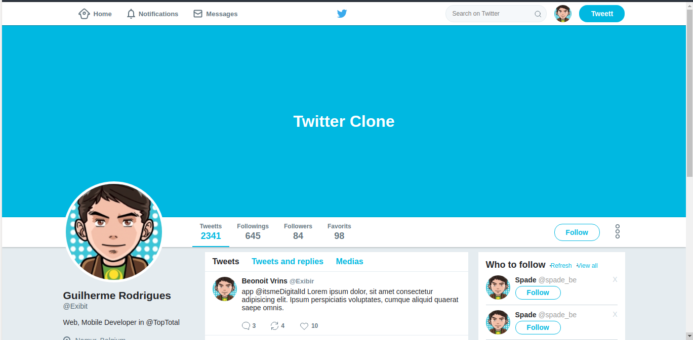
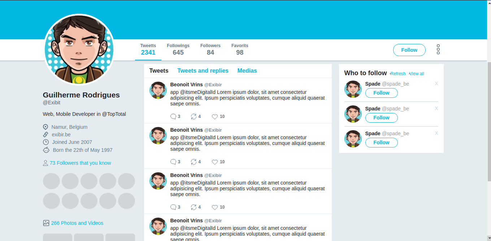

 Twitter Clone: Aplicação web desenvolvida usando os conhecimentos de flexbox.

  

  

 

  

## Licença

Esse projeto é licensiado pela MIT License - Veja a página da [licença](https://opensource.org/licenses/MIT) para detalhes
